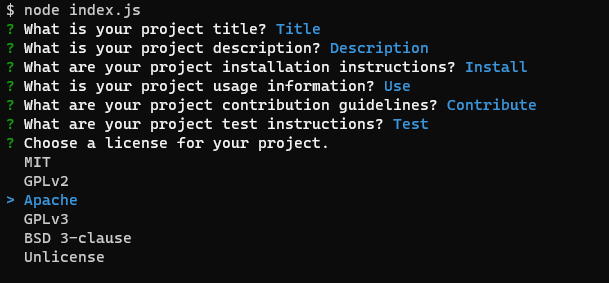
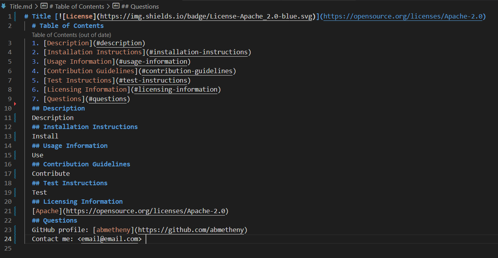
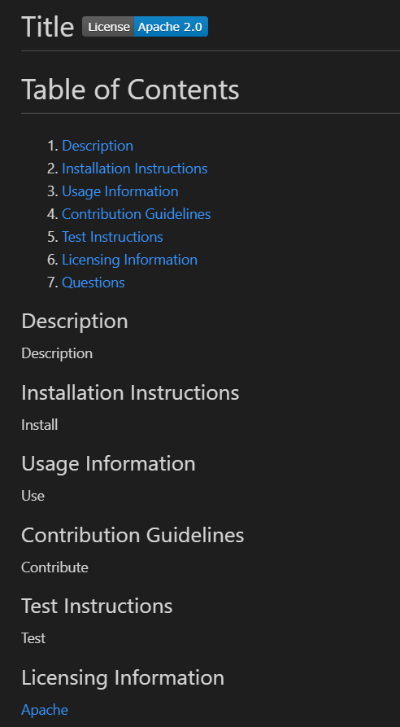

# readme-generator
Quickly and easily generate a README file using a command-line application.

## User Story
AS A developer  
I WANT a README generator  
SO THAT I can quickly create a professional README for a new project

## Acceptance Criteria
GIVEN a command-line application that accepts user input  
WHEN I am prompted for information about my application repository  
THEN a high-quality, professional README.md is generated with the title of my project and sections entitled Description, Table of Contents, Installation, Usage, License, Contributing, Tests, and Questions  
WHEN I enter my project title  
THEN this is displayed as the title of the README  
WHEN I enter a description, installation instructions, usage information, contribution guidelines, and test instructions  
THEN this information is added to the sections of the README entitled Description, Installation, Usage, Contributing, and Tests  
WHEN I choose a license for my application from a list of options  
THEN a badge for that license is added near the top of the README and a notice is added to the section of the README entitled License that explains which license the application is covered under  
WHEN I enter my GitHub username  
THEN this is added to the section of the README entitled Questions, with a link to my GitHub profile  
WHEN I enter my email address  
THEN this is added to the section of the README entitled Questions, with instructions on how to reach me with additional questions  
WHEN I click on the links in the Table of Contents  
THEN I am taken to the corresponding section of the README

## Description of Work Performed
* Imported Inquirer package to allow user interface with terminal
* Wrote questions for users to answer in the command-line application
* Answers to command-line questions are passed into a JavaScript function to generate and populate a README
  * User-entered title is used as the title of the generated README
  * User-selected license is displayed as a clickable banner at the top as well as a clickable link in the License section
  * GitHub username links to user's GitHub profile page
  * Email address is clickable and opens a blank email
  * Table of contents links to relative sections within the README

## Link to deployed GitHub page
[Deployed Challenge 9 README Generator](https://abmetheny.github.io/readme-generator/)

## Screenshots

## License
This project is licensed under the MIT License - see the LICENSE.md file for details.

# Resources
- Node packages: [Inquirer](https://www.npmjs.com/package/inquirer)
- License badges: [Markdown License Badges Repo](https://gist.github.com/lukas-h/2a5d00690736b4c3a7ba)